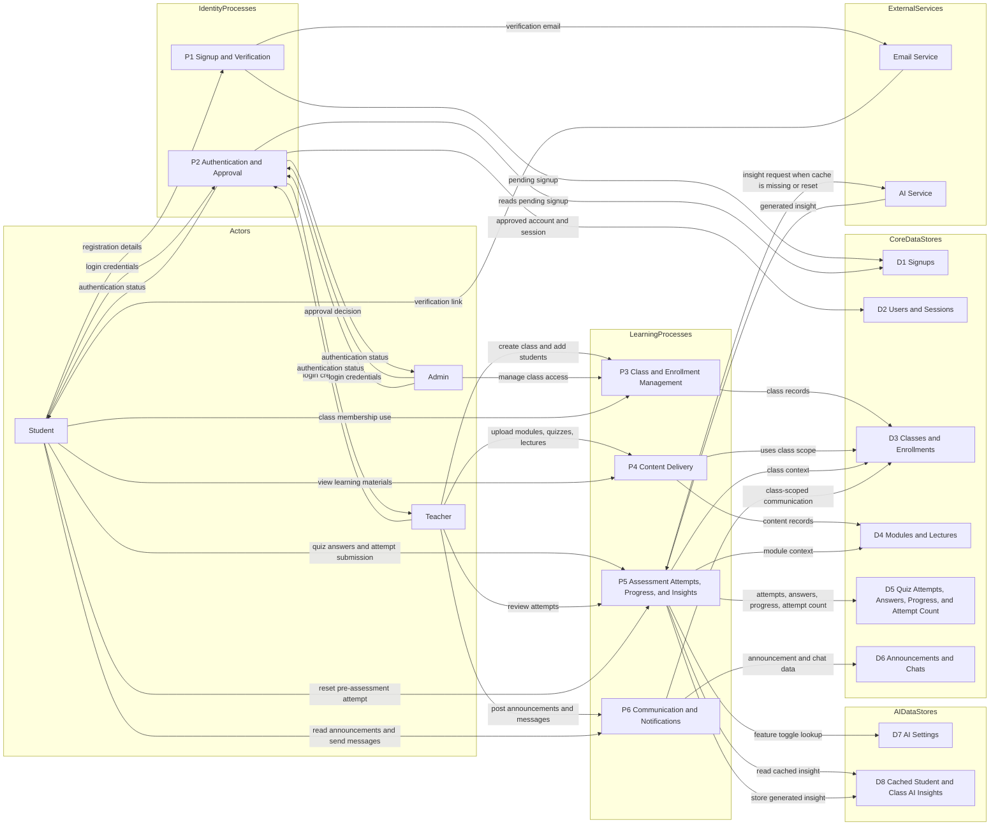
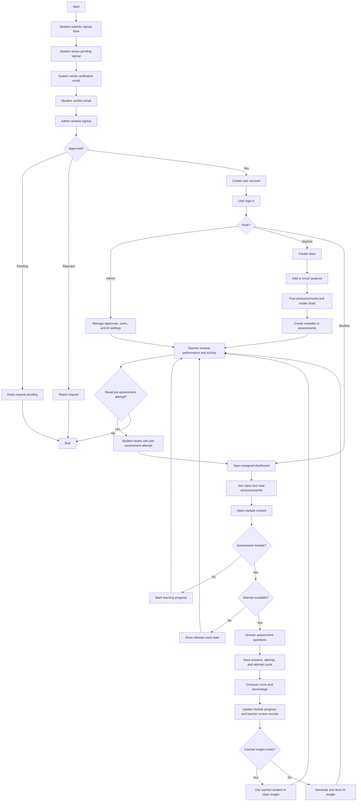

# Reviso Data and Process Modelling Diagrams

## Data Flow Diagram

> Figure 7: Data and Process Modelling (Context-Level)

## Process Model

> Figure 8: Data and Process Modelling (Level-1)

## Notes

- The data flow diagram is a logical model of how information moves through Reviso.
- The process model shows the main end-to-end LMS flow from signup to learning and monitoring.
- `lectures` are included as a content store, but the current class learning path is centered on `modules` and quizzes.